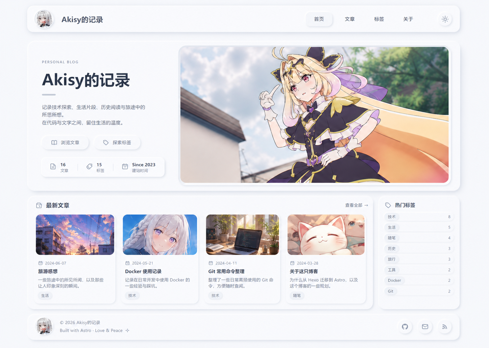

# Astro Neumorphic Anime Theme Design

Date: 2026-06-21

## Summary

Create a restrained light-neumorphic theme for the existing Astro blog, with the homepage centered on a large anime image showcase. The UI should stay soft, quiet, and readable; the anime imagery supplies the visual impact.

Selected visual reference:

## Goals

- Preserve the current blog information architecture: home, posts, tags, about, and post detail pages.
- Redesign the visual system around soft white and cool-gray neumorphic surfaces.
- Add a large homepage image showcase using existing anime assets, starting with `/images/background.jpeg`.
- Keep icons, small glyphs, stat markers, tag symbols, and utility controls in a unified light gray system.
- Make the theme responsive and comfortable on desktop and mobile.
- Keep interactions minimal: page/view transitions, focus states, and subtle hover transitions only.

## Non-Goals

- No carousel, auto-rotating gallery, heavy animation, or interactive image controls.
- No new content model, CMS, search, comments, dark mode, or pagination in this pass.
- No decorative blobs, purple gradient background, beige/tan palette, or saturated icon system.
- No broad refactor outside the existing Astro layout, component, page, and global style boundaries.

## Visual System

The base surface uses a light cool palette:

- Page background: mist white / cool gray, close to `#f4f7fb`.
- Main surface: near-white, close to `#fbfcff`.
- Text: deep cool navy-gray for headings, softer slate-gray for body copy.
- Accent: very restrained cool blue-gray for active states and focus rings.
- Icon system: light gray and cool gray-blue only, using tones around `#9aa7b5`, `#b8c1cc`, and `#d7dee8`.

Neumorphism should be restrained. Use paired light and dark shadows to create raised surfaces, and inset shadows only for pressed controls or image wells. Corners should stay moderate, generally 8-12px, matching the existing project's disciplined radius.

Anime images keep their original color and contrast. They are the only strongly saturated elements on the page.

## Homepage Design

The homepage becomes the primary expression of the theme.

Top navigation:

- Keep a single header with avatar, `Akisy的记录`, and links for `首页`, `文章`, `标签`, and `关于`.
- Header is a raised neumorphic bar with soft rounded corners.
- Active and hover states use pressed surfaces, not saturated colors.
- Any decorative or utility icon in the header uses the shared light-gray icon system.

Hero:

- Use a two-column hero on desktop.
- Left side contains eyebrow text, `Akisy的记录`, a short Chinese intro, two subtle pill links, and compact stats.
- Right side contains a large landscape anime image panel.
- The image panel should feel inset into the page with a soft frame and rounded corners.
- On mobile, stack the text and image while keeping the image prominent.

Latest posts:

- Keep the existing latest-posts section, but restyle cards with neumorphic surfaces.
- Use 3-4 cards on wide screens and a single column on narrow screens.
- Card images remain vivid; metadata icons and small card glyphs use light gray.
- Tags should be pale chips with gray text/icon treatment. If a tag has a tint, it must be very soft.

Tag sidebar:

- Add or restyle a small `热门标签` surface on the homepage.
- Use lightweight rows or chips rather than colorful badges.
- Counts are muted and secondary.

Footer:

- Keep the simple footer.
- Footer social/action icons use the same gray circular treatment as the selected mock.

## Other Pages

Posts index:

- Reuse the neumorphic page header, post list/card styling, muted metadata, and pale tags.
- Do not add a new layout model; adapt the existing `posts/index.astro` and `PostCard` composition.

Tags:

- Restyle tag cloud chips to match the homepage tag system.
- Preserve current routing and tag data behavior.

About:

- Use the same page header and prose styling as the post detail pages.

Post detail:

- Keep the existing `BlogPostLayout` structure.
- Update post hero, cover image, tag list, prose blocks, code blocks, and images to match the new visual tokens.
- Preserve comfortable reading width and serif body copy.

## Component Boundaries

Keep the implementation aligned with current files:

- `src/layouts/BaseLayout.astro`: global wrapper, body class hooks if needed, and Astro view transition support.
- `src/layouts/BlogPostLayout.astro`: post hero and article detail structure.
- `src/components/Header.astro`: navigation and brand shell.
- `src/components/Footer.astro`: footer content and gray icon controls if present.
- `src/components/PostCard.astro`: post card image, metadata, title, excerpt, and tags.
- `src/components/TagList.astro`: shared tag chip styling.
- `src/pages/index.astro`: homepage hero, selected image showcase, stats, latest posts, and tag sidebar.
- `src/styles/global.css`: theme tokens, layout primitives, neumorphic utilities, responsive rules, transitions, and prose styling.

Only add new components if they remove meaningful duplication from the homepage, such as a small `Icon` or `HomeStats` component. Otherwise keep the change compact.

## Data And Assets

Use existing content and utilities:

- Published posts come from `getPublishedPosts()`.
- Post cards use existing `BlogPost` data.
- Tag chips use existing tag arrays.
- Homepage image showcase starts with `/images/background.jpeg`.
- Avatar continues to use `/images/whitehairblueeyes.jpeg`.

If additional homepage thumbnails are needed, use existing images under `public/images/` before adding new assets.

## Motion And Interaction

Motion stays quiet:

- Add subtle transitions for links, buttons, cards, and focus states.
- Add Astro view transitions in `BaseLayout.astro` so route changes can fade/settle softly.
- Respect `prefers-reduced-motion`.
- Avoid floating, bouncing, auto-rotating, parallax, or attention-grabbing animation.

## Accessibility

- Maintain semantic landmarks: header, nav, main, sections, article, footer.
- Keep visible focus states for links and buttons.
- Ensure contrast remains readable despite the low-contrast visual style.
- Do not rely on color alone for active navigation or tag meaning.
- Provide meaningful alt text where images communicate content; keep decorative avatars or repeated thumbnails empty when appropriate.

## Responsive Behavior

- Desktop: constrained page width with two-column hero and latest-post grid plus tag sidebar.
- Tablet: hero remains two-column if space allows; post grid reduces gracefully.
- Mobile: header stacks or wraps, hero stacks, stats wrap, cards become single column, tag sidebar follows latest posts.
- Avoid horizontal overflow and clipped text at 320px width.

## Testing And Verification

After implementation:

- Run `npm run build`.
- Run `npm test` if build succeeds.
- Start the dev server and visually inspect the homepage, posts index, tags page, about page, and a post detail page.
- Check desktop and mobile widths for overflow, clipped cards, unreadable text, and image cropping.
- Confirm all small UI icons and decorative glyphs use the light gray system.
- Confirm anime images remain vivid and are not desaturated by global filters.

## Acceptance Criteria

- The site reads as a coherent light-neumorphic Astro blog theme.
- Homepage has a large anime image showcase matching the selected direction.
- UI chrome and icons are quiet gray; anime imagery is the main source of strong color.
- Existing routes and content continue to work.
- Build and migration verification pass.
- Mobile layout is usable and visually consistent.
